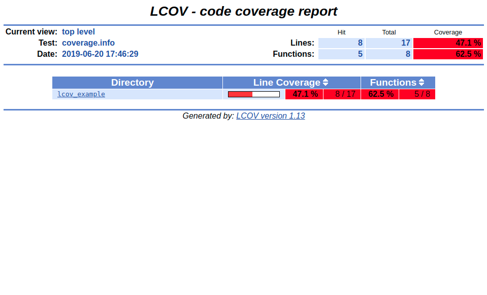
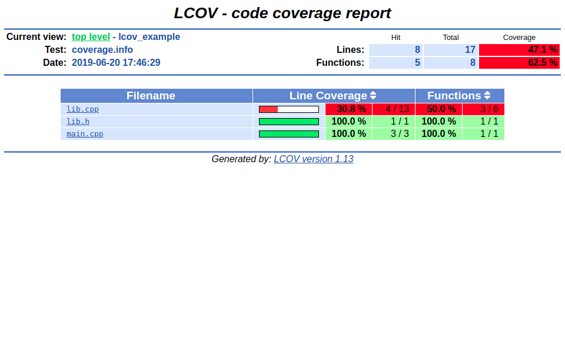
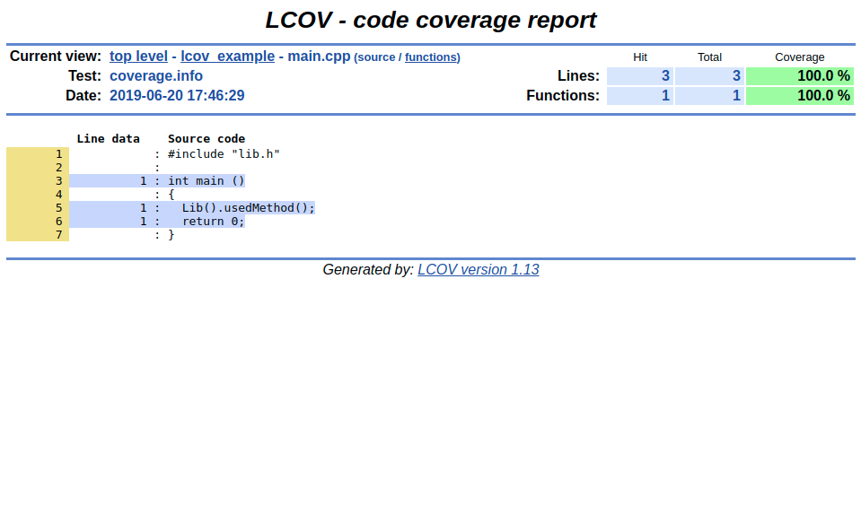
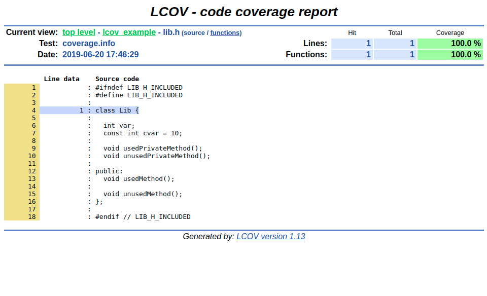
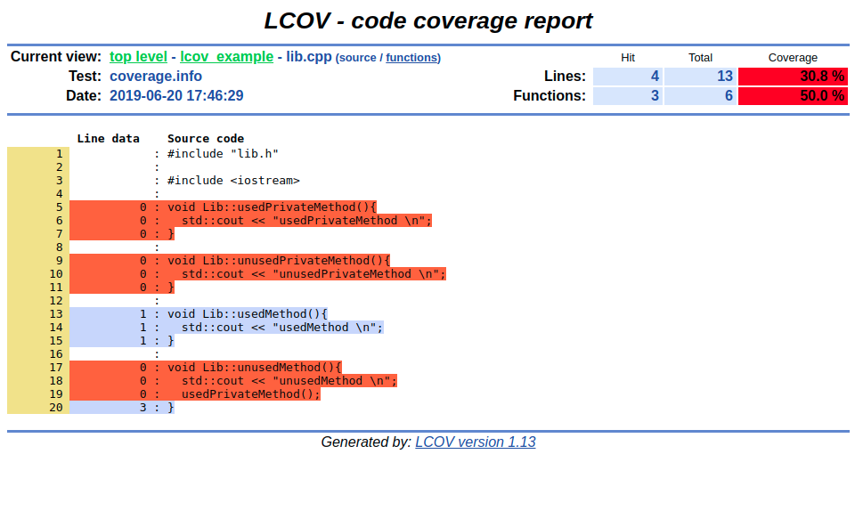

# lcov simple example

## Generating a coverage report using the command line

1. Folder structure at the beginning (not relevant files removed):
```
.
├── lib.cpp
├── lib.h
├── main.cpp
└── Makefile
```

2. Compile sources with `--coverage`-flag (used by compiler and linker):
```
$ g++ main.cpp lib.cpp --coverage
```
new files:
```
.
├── a.out
├── lib.gcno
└── main.gcno
```

3. Run the executable:
```
$ ./a.out
usedMethod
```
new files:
```
.
├── lib.gcda
└── main.gcda
```

4. Collect coverage data:
```
$ lcov --capture --directory . --output-file coverage.info
Capturing coverage data from .
Found gcov version: 7.4.0
Scanning . for .gcda files ...
Found 2 data files in .
Processing main.gcda
Processing lib.gcda
Finished .info-file creation
```
new files:
```
├── coverage.info
└── main.cpp.gcov
```

5. Optionally remove invoked standard libraries from the report:
```
$ lcov --remove coverage.info "/usr*" -o coverage.info
Reading tracefile coverage.info
Removing /usr/include/c++/7/iostream
Deleted 1 files
Writing data to coverage.info
Summary coverage rate:
  lines......: 47.1% (8 of 17 lines)
  functions..: 62.5% (5 of 8 functions)
  branches...: no data found
```

6. Generate HTML report:
```
$ genhtml coverage.info --output-directory=./cov.dir
Reading data file coverage.info
Found 3 entries.
Found common filename prefix "/tmp/gtzgtoghiut"
Writing .css and .png files.
Generating output.
Processing file lcov_example/lib.h
Processing file lcov_example/main.cpp
Processing file lcov_example/lib.cpp
Writing directory view page.
Overall coverage rate:
  lines......: 47.1% (8 of 17 lines)
  functions..: 62.5% (5 of 8 functions)
```
new files:
```
.
└── cov.dir
    ├── amber.png
    ├── emerald.png
    ├── gcov.css
    ├── glass.png
    ├── index.html
    ├── index-sort-f.html
    ├── index-sort-l.html
    ├── lcov_example
    │   ├── index.html
    │   ├── index-sort-f.html
    │   ├── index-sort-l.html
    │   ├── lib.cpp.func.html
    │   ├── lib.cpp.func-sort-c.html
    │   ├── lib.cpp.gcov.html
    │   ├── lib.h.func.html
    │   ├── lib.h.func-sort-c.html
    │   ├── lib.h.gcov.html
    │   ├── main.cpp.func.html
    │   ├── main.cpp.func-sort-c.html
    │   └── main.cpp.gcov.html
    ├── ruby.png
    ├── snow.png
    └── updown.png
```

7. HTML report:

  _coverage report main page_
  

  _coverage report file overview_
  

  _coverage report main.cpp_
  

  _coverage report lib.h_
  

  _coverage report lib.cpp_
  

# References

> http://ltp.sourceforge.net/coverage/lcov.php/lcov/genhtml.1.php

> https://qiaomuf.wordpress.com/2011/05/26/use-gcov-and-lcov-to-know-your-test-coverage/

# Troubleshooting

## empty gcov object file
```
Processing file.gcda
geninfo: WARNING: empty */file.gcno (skipped)
```
If header files (`*.h`) are given to the compiler, this will result into `*.h.gch`-files and the corresponding `*.gcno`-file stays empty. In this case gcov/lcov will generate an incomplete report.


## GCC - GCOV version mismatch

```
Processing main.gcda
/*/main.gcno:version '402*', prefer 'A74*'
```

> https://stackoverflow.com/questions/12454175/gcov-out-of-memory-mismatched-version
